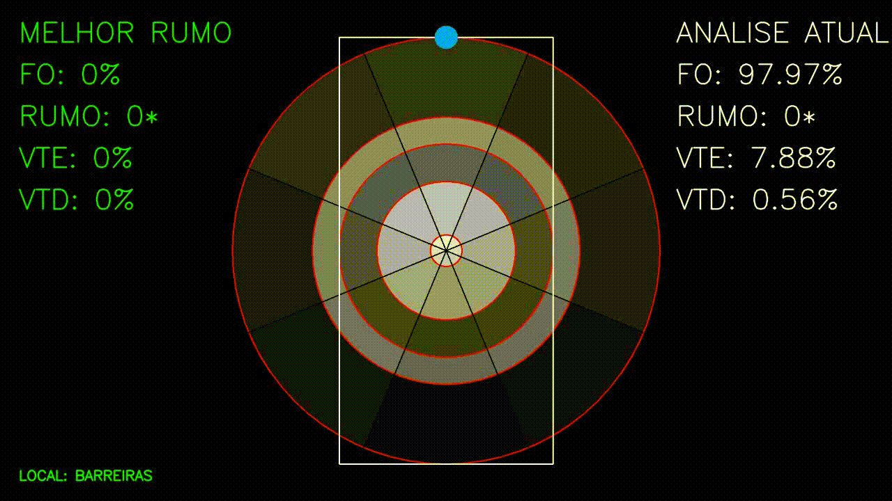

<h2 align="center">HEURISTIC OPTIMIZATION IN RUNWAY ORIENTATION - ( HORO's )</h2>

<p align="center">
  <a href="" rel="noopener">
 </a>
</p>

<div align="center">

[]()
[](https://github.com/kylelobo/The-Documentation-Compendium/issues)
[](https://github.com/kylelobo/The-Documentation-Compendium/pulls)
[](/LICENSE)

</div>

---

<p align="center"> 
    Before running the project, it is necessary to extract the compressed browser located in Modulos\BROWSER\chrome-win.zip. Please extract the files within this folder, as this is a prerequisite for the algorithm to function properly. The extracted browser will be used to obtain the magnetic declination.
    <br> 
    <h4>1° Primeiro Passo</h4>
    Inserir seus dados metereologicos dentro da pasta INPUT na raiz do projeto, lembrando que tais informações precisam ter pelo menos 5 anos de historico e, deve conter o minimo necessario pra realizar essa analise, sendo os ventos e suas recpectivas direções além da latitude e longitude em decimal para obtenção da declinação magnetica.
    <br>
    A depender dos seus dados muito provavelmente você ira precisar criar usa função de leitura dos dados para prosseguir com a analise, neste trabalho a função usada para tal finalidade é a ReadDatasets.
    <h4>2° Segundo Passo</h4>
    Configure o arquivo Default.py com suas variaveis padrões, principalmente se seu aeroporto não for um internacional, assim será preciso alterar os limites.
    <h4>3° Terceiro Passo</h4>
    .....
</p>

## 📝 Table of Contents

- [About](#about)
- [Getting Started](#getting_started)
- [Deployment](#deployment)
- [Usage](#usage)
- [Built Using](#built_using)
- [TODO](../TODO.md)
- [Contributing](../CONTRIBUTING.md)
- [Authors](#authors)
- [Acknowledgments](#acknowledgement)

## 🧐 About <a name = "about"></a>

Write about 1-2 paragraphs describing the purpose of your project.

## 🏁 Getting Started <a name = "getting_started"></a>

These instructions will get you a copy of the project up and running on your local machine for development and testing purposes. See [deployment](#deployment) for notes on how to deploy the project on a live system.

### Prerequisites

What things you need to install the software and how to install them.

```
Give examples
```

### Installing

A step by step series of examples that tell you how to get a development env running.

Say what the step will be

```
Give the example
```

And repeat

```
until finished
```

End with an example of getting some data out of the system or using it for a little demo.

## 🔧 Running the tests <a name = "tests"></a>

Explain how to run the automated tests for this system.

### Break down into end to end tests

Explain what these tests test and why

```
Give an example
```

### And coding style tests

Explain what these tests test and why

```
Give an example
```

## 🎈 Usage <a name="usage"></a>

Add notes about how to use the system.

## 🚀 Deployment <a name = "deployment"></a>

Add additional notes about how to deploy this on a live system.

## ⛏️ Built Using <a name = "built_using"></a>

- [MongoDB](https://www.mongodb.com/) - Database
- [Express](https://expressjs.com/) - Server Framework
- [VueJs](https://vuejs.org/) - Web Framework
- [NodeJs](https://nodejs.org/en/) - Server Environment

## ✍️ Authors <a name = "authors"></a>

- [@kylelobo](https://github.com/kylelobo) - Idea & Initial work

See also the list of [contributors](https://github.com/kylelobo/The-Documentation-Compendium/contributors) who participated in this project.

## 🎉 Acknowledgements <a name = "acknowledgement"></a>

- Hat tip to anyone whose code was used
- Inspiration
- References
